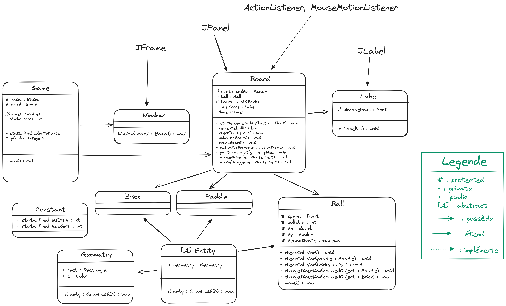

__Weber Loïc IDIA3__

# JAVA POO Projet Breakout

## Introduction

Dans ce projet, mon objectif était de découvrir pour la première fois le langage Java, les bonnes pratiques en Programmation Orienté Objets et de recréer une copie la plus convaincante possible du [jeu d'Arcade Breakout (1971)](https://en.wikipedia.org/wiki/Breakout_(video_game)).

## Utilisation

Version de java : openjdk 17.0.11

```shell
java --version
```

Cloner :
```shell
git clone https://gitlab.univ-nantes.fr/E23B956N/breakout-java.git
cd breakout-java
```

Compiler :

```shell
make build
```

Lancer :
```shell
make run
```
## Structure du projet

```
.
├── bin                         # Binaires (codes compilés)
|   └── ...
├── Makefile
├── README.md
├── res                         # Ressources (images, fonts..)
│   ├── Arcade.ttf
│   ├── screenshot2.png
│   └── sreenshot1.png
└── src                         # Codes source (.java)
    ├── entities                # entities package ( objets affiché à l'écran)
    │   ├── Ball.java
    │   ├── Brick.java
    │   ├── Entity.java
    │   ├── MovingEntity.java
    │   └── Paddle.java
    ├── main                    # main package (intelligence haut niveau, création de la fenetre, instanciation des objets...)
    │   ├── Board.java
    │   ├── Game.java
    │   └── Window.java
    ├── utils                   # utils package
    │   └── Constant.java
    └── visuals                 # visuals package (rendu à l'écran, forme géometrique et textes)
        ├── Geometry.java
        └── Label.java
```

## Schéma UML

  

## Etapes du projet

- [X] Créer un git pour le projet.
- [X] Créer un premier schéma UML.
- [X] Se familiariser avec le code PONG de TP.
- [X] Créer une première fenetre avec swing et AWT graphics.
- [X] Créer une balle qui rebondit sur les murs sauf le sol.
- [X] Créer le Pallet.
- [X] Créer le toit de Briques.
- [X] Ajouter des collisions.
- [X] Détruire les briques à l'impact.
- [X] Ajouter des couleurs.
- [X] Créer le système de score et de points.
- [X] Ajouter des Labels de textes.
- [X] Changer la vitesse de la balle.
- [X] Séparer le projet en plusieurs packages.
- [X] Corriger les propriétés des classes, variables et méthodes (public, private protected).
- [X] Créer un makefile pour compiler et lancé le projet.
- [X] Corriger le schéma UML.
- [X] Ecrire une Documentation README.md.
- [X] Rendre le Projet.

## Images

  
---
  

